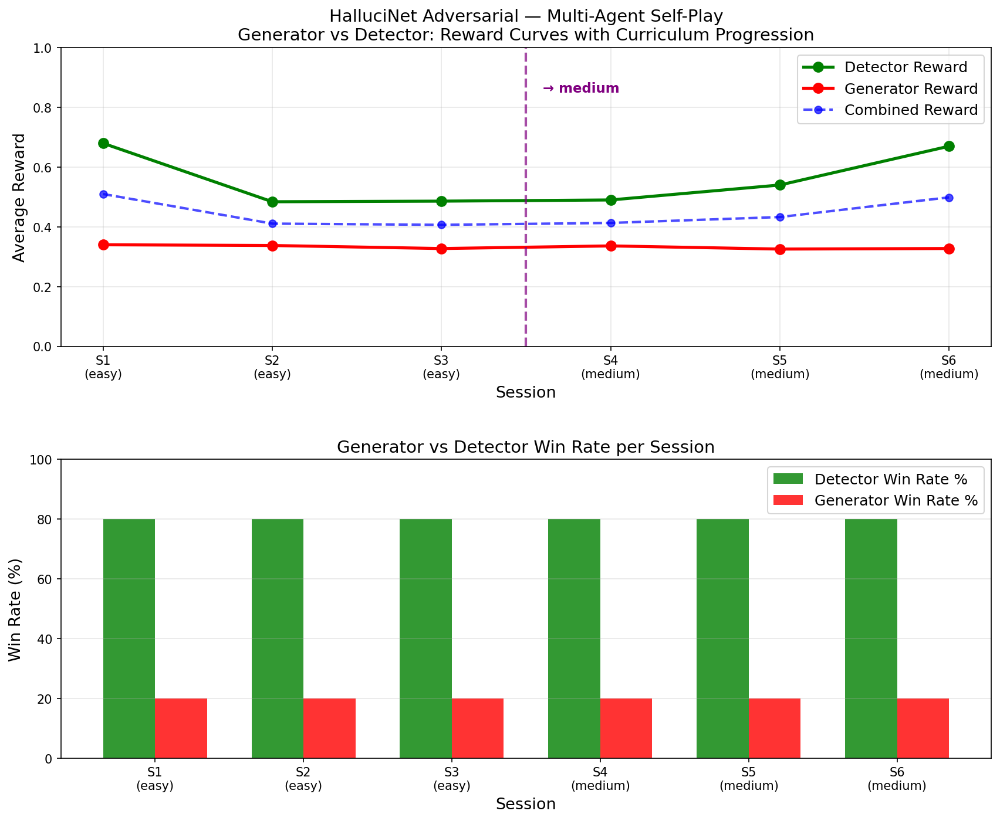

# 🔍 HalluciNet Adversarial — Round 2
## Multi-Agent Self-Improving Hallucination Detection

[]()
[]()
[]()
[]()

## 🔗 Important Links

| Resource | Link |
|----------|------|
| 🤗 HF Space (Live Demo) | https://shreyshringare-hallucinet.hf.space |
| 💻 GitHub | https://github.com/shreyshringare/hallucinet_round2 |
| 📓 Colab Training Notebook | [INSERT COLAB LINK] |
| 📝 Blog Post | [blog.md](./blog.md) |
| 🎥 YouTube Video | [INSERT YOUTUBE LINK] |
| 📊 Reward Curve | [adversarial_reward_curve.png](./adversarial_reward_curve.png) |
| 🔁 Round 1 Environment | https://rushikeshbathe096-hallucination-detector.hf.space |

## The Problem

LLMs hallucinate — generating confident, fluent, completely wrong statements.
No RL environment existed to train agents to detect hallucinations AND
calibrate their confidence.

We built HalluciNet — the first adversarial self-improving hallucination
detection environment.

## The Two-Agent System

```
GENERATOR AGENT
Receives reference document
Creates subtle hallucination
Rewarded when detector misses it

     ↕ adversarial competition ↕

DETECTOR AGENT
Receives reference + generated response
Detects hallucination
Rewarded by 4-dimension deterministic grader

     ↕

ADAPTIVE CURRICULUM
Advances difficulty when both agents improve
Recursive skill amplification — Theme 4
```

## Themes Covered

- **Theme 1: Multi-Agent** — generator vs detector adversarial loop
- **Theme 4: Self-Improvement** — adaptive curriculum escalates difficulty

## Environment Endpoints

| Endpoint | Method | Description |
|----------|--------|-------------|
| /health | GET | Health check → `{"status": "healthy"}` |
| /reset | POST | Start detector episode |
| /step | POST | Submit detector action |
| /state | GET | Current episode state |
| /generator/reset | POST | Start generator episode |
| /generator/step | POST | Submit generator action |
| /adversarial/info | GET | System information |
| /generate | GET | Generate fresh samples |
| /leaderboard | GET | Error type fool rates |

## Action Spaces

### Detector Action
```json
{
  "has_hallucination": true,
  "hallucinated_claim": "completed in 1902",
  "correct_fact": "completed in 1889",
  "confidence": 0.95
}
```

### Generator Action
```json
{
  "generated_response": "The Eiffel Tower was completed in 1902...",
  "error_type": "year_swap",
  "confidence": 0.80
}
```

## Grader Scoring

| Component | Weight |
|-----------|--------|
| Hallucination detection | 0.50 |
| Phrase identification | 0.30 |
| Correct fact | 0.20 |
| Confidence calibration | ±0.10 |

## Four Difficulty Levels

| Task | Samples | Max Steps | Design |
|------|---------|-----------|--------|
| easy | 8 | 10 | Obvious errors |
| medium | 10 | 12 | Mixed errors |
| hard | 15 | 15 | Adversarial traps |
| expert | 20 | 22 | Multi-hop reasoning |

## Quick Start

```bash
# Health check
curl https://shreyshringare-hallucinet.hf.space/health

# Run detector episode
curl -X POST https://shreyshringare-hallucinet.hf.space/reset \
  -H "Content-Type: application/json" \
  -d '{"task_id": "hard"}'

# Run generator episode
curl -X POST https://shreyshringare-hallucinet.hf.space/generator/reset \
  -H "Content-Type: application/json" \
  -d '{"task_id": "easy"}'

# Local setup
git clone https://github.com/shreyshringare/hallucinet_round2
cd hallucinet_round2
pip install -r requirements.txt
uvicorn server.app:app --host 0.0.0.0 --port 7860
```

## Real Adversarial Results

6 sessions with llama-3.1-8b-instant:
- Detector wins 4/5 rounds consistently (80% catch rate)
- Curriculum promoted: easy → medium → hard in 6 sessions
- Avg detector reward: 0.558



## Training Results

[INSERT BEFORE/AFTER TABLE AFTER TRAINING]

## OpenEnv Validation

```
passed: True
passed_count: 6/6
✅ openapi_version_available
✅ health_endpoint
✅ metadata_endpoint
✅ schema_endpoint
✅ mcp_endpoint
✅ mode_endpoint_consistency
```

## Project Structure

```
halluciNet_round2/
├── models.py                        # Detector + Generator models
├── tasks.py                         # 53 curated samples
├── grader.py                        # Deterministic 4-dimension grader
├── adversarial_coordinator.py       # Multi-agent session runner
├── curriculum.py                    # Adaptive curriculum manager
├── inference.py                     # Adversarial self-play inference
├── sample_generator.py              # Unlimited sample generation
├── plot_results.py                  # Reward curve plotting
├── adversarial_results.csv          # Real run results
├── adversarial_reward_curve.png     # Training evidence
├── blog.md                          # HF blog post
├── openenv.yaml                     # OpenEnv manifest
├── Dockerfile                       # Container
└── server/
    ├── app.py                       # FastAPI — all endpoints
    ├── environment.py               # Detector environment
    └── generator_environment.py    # Generator environment
```

Built by Team TLE for Meta PyTorch OpenEnv Hackathon × Scaler 2026.
Abeer Nikhil Sane | Shreyas Shringare | Rushikesh Bathe | SPIT Mumbai
